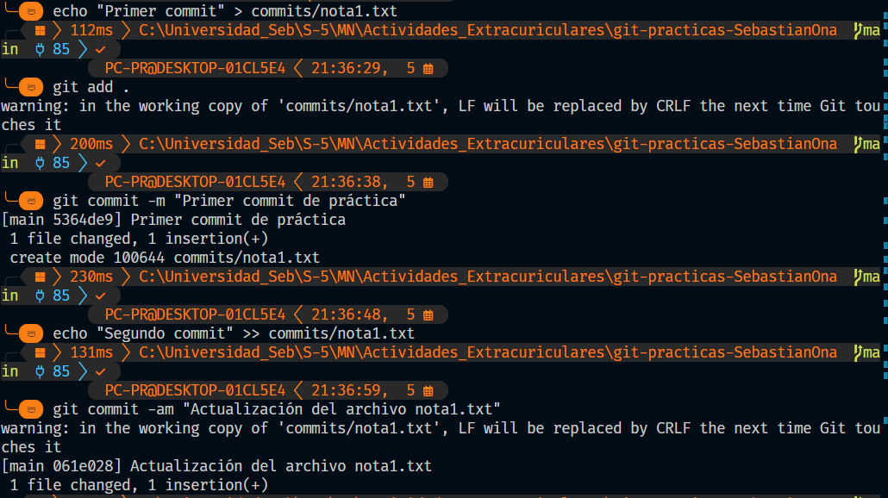
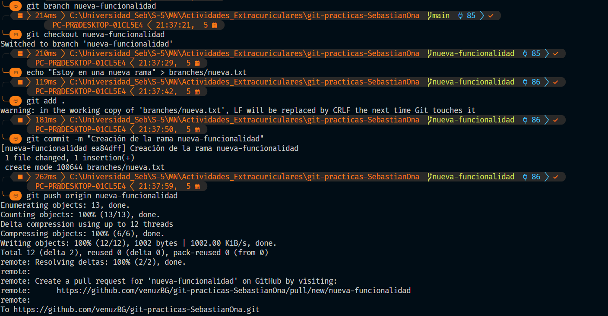
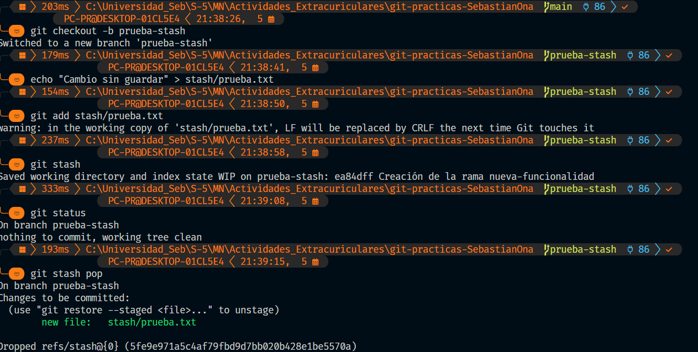
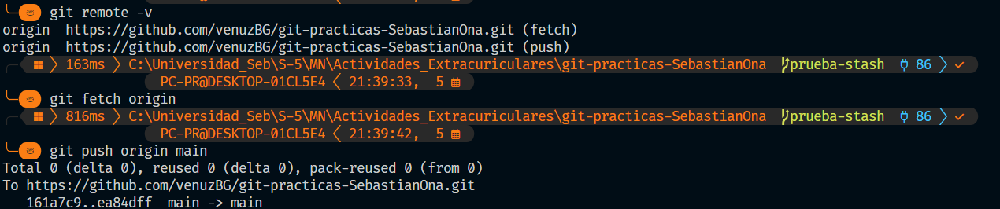
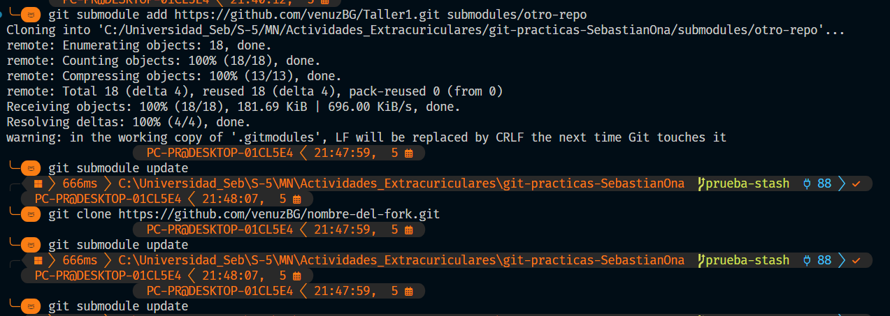
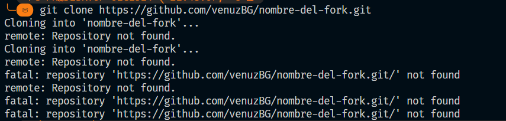

# Laboratorio de Git y GitHub - Sebastian Oña

Este repositorio contiene ejercicios prácticos para dominar los principales comandos y flujos de trabajo de Git y GitHub.

| Concepto | Evidencia |
|-----------|------------|
| Commit |  |
| Branch |  |
| Stash |  |
| Remote / Push / Fetch |  |
| Submodule | |
| Fork / Pull Request | |
